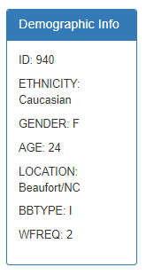
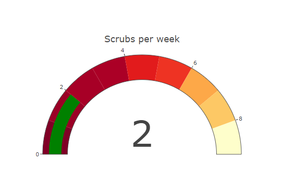

# Belly Button Challenge
## Javascript static page to load data on different belly buttons, observed in a study
### This page is hosted on github pages at: https://jojoalva.github.io/belly-button-challenge/

**Project aim:**

    Use the D3 library to read in samples.json which is in this repository.

    Create a horizontal bar chart with a dropdown menu to display 
    the top 10 OTUs found in that individual.

    Use sample_values as the values for the bar chart.

    Use otu_ids as the labels for the bar chart.

    Use otu_labels as the hovertext for the chart.

    Create a bubble chart that displays each sample.

    Use otu_ids for the x values.

    Use sample_values for the y values.

    Use sample_values for the marker size.

    Use otu_ids for the marker colors.

    Use otu_labels for the text values.

    Display the sample metadata, i.e., an individual's 
    demographic information.

    Display each key-value pair from the metadata JSON 
    object somewhere on the page.

    Update all the plots when a new sample is selected.

    Adapt the Gauge Chart to plot the weekly washing frequency of the 
    individual for values ranging from 0 through 9.
    

    Update the chart whenever a new sample is selected.

**How to set up**:

    Download the repository files into your local directory.

    Open the "index.html" file in your Chrome browser.

    The below dashboard should now be visible:

    Scroll through the data using the dropdown box, and there you will see
    the dashboard updates as you choose different IDs.

**Resources:**

The data for this challenge was obtained from the following URL:

https://robdunnlab.com/projects/belly-button-biodiversity/

